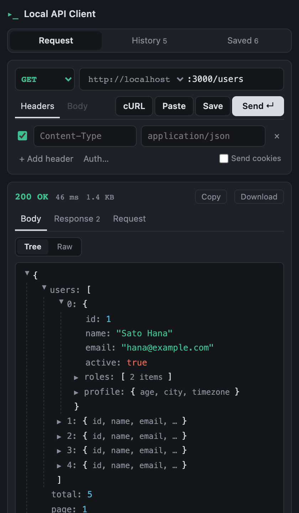

# Local API Client

[日本語](README.ja.md)

A minimal REST client for localhost, as a Chrome extension side panel.



## Principles

- **Least privilege**: `permissions` is only `sidePanel` and `storage`. `host_permissions` is only localhost / 127.0.0.1
- **Zero external communication**: no analytics, no cloud sync, no external fonts. Your data never leaves your machine
- **Only what is needed**: build a request, send it, read the response.

## Privacy

Nothing is collected or transmitted. Everything stays in `chrome.storage.local`
on your device. See the [Privacy Policy](PRIVACY.md) for details.

## Install

Chrome Web Store: (coming soon)

## Development

```bash
npm install
npm run build   # outputs to dist/
npm run dev     # to check the UI in a browser (chrome.* APIs do not work)
```

To run your build in Chrome:

1. Open `chrome://extensions`
2. Turn on "Developer mode" in the top right
3. "Load unpacked" → select the `dist/` folder

To try it out, start any local server:

```bash
python3 -m http.server 3000
# In the extension: GET http://localhost + :3000/ → a 200 means it works
```

## Notes

- **Body (Fields)** values keep their JSON type when they parse (`30` → number, `"30"` → string, `true` → boolean), and are sent as plain strings otherwise. `application/json` is added automatically unless you set a Content-Type
- **History and saved requests hold 30 entries each.** Older ones are dropped automatically
- **Responses are read up to 1 MB.** Anything past that is dropped and marked `truncated`,
  to keep a huge response from freezing the panel. The size shown is always the real one
- **History keeps the response too**, so clicking an entry brings back what you got.
  Bodies kept in history are capped at 30 KB; anything longer is cut and marked `truncated`
- **A `truncated` body is never parsed as JSON**, so the raw text is shown instead of the tree
- **Export files contain your headers and bodies as-is**

## Test and Lint

```bash
npm test          # run Vitest once
npm run test:watch
npm run lint      # Biome (lint + format check)
npm run lint:fix  # apply fixes
```

## Contributing

As a security policy, **pull requests are not being accepted for now.**

Please open an Issue for bug reports and suggestions.

## About development

This project is built with the help of [Claude](https://claude.com) (Anthropic).
